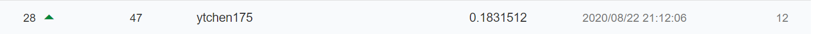

# aidea_leave_job

###### Model : `Catboost`, `RandomForestClassifier`
###### Library : `Catboost`, `Scikit-Learn` 
###### Keywords : `Machine Learning`, `Feature Selection`, `Feature Engineering`, `RFECV`, `Grid Search`

# Description

After a bunch of experiments (like feature engineering, adding clustering layer, metrics implementation, weight adjustment, etc.), \
finally, I chose catboost as ML model and optimized its performance by feature selection using RFECV.

# Rank

I am the **top 5% （28/467）** of this competition at private leaderboard.

Competition link : [員工離職預測](https://aidea-web.tw/topic/926a5d08-c74f-453c-9e75-bad4586dd271)

